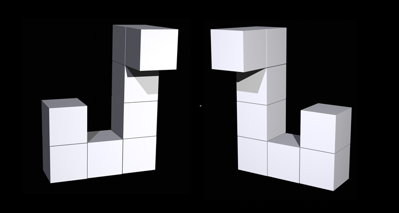

# mental-rotation-project

This is an experiment using `magpie`.

You will be presented with similar or identical 3-dimensional objects and are required to judge if they are `same` or `different` by pressing keys according to the instruction on the screen.

Here is an example of the pictures that you will see:

After each key press, feedback is provided as to whether the response is `correct` or `wrong`. You are expected to try to optimize both your speed and accuracy.

There was 12 pictures in total for the training trail. The main trial will start after that.

At the end, according to the instruction on the screen, you might be asked to participate in a servey or give feedback.

